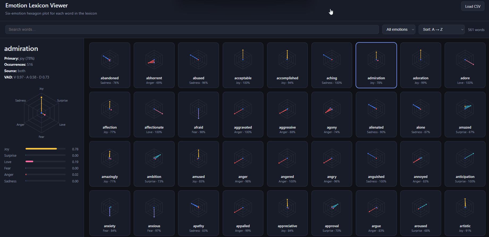

# Emotion Dataset

A local emotion lexicon built from two research datasets, plus a browser viewer for exploring word→emotion profiles. The goal is fast, offline sentiment-style analysis — for example, mapping words in an Unreal Engine room to lighting colors without making web requests.



## What’s in this repo

| Path | Description |
|------|-------------|
| `dair/` | CARER / Hugging Face six-emotion Twitter dataset (`merged_training.pkl`) |
| `borealis/` | CR4-NarrEmote narrative emotion annotations (CSV) |
| `export_lexicon.py` | Builds `merged_emotion_lexicon.csv` from both sources |
| `merged_emotion_lexicon.csv` | Primary output — word lookup table for Unreal / heuristics |
| `emotion_lexicon.csv` | Earlier dair-only lexicon (reference) |
| `viewer/` | Vanilla JS hexagon visualizer for the lexicon |
| `docs/dataset-processing.md` | How each dataset is processed and merged |
| `docs/room-light-strategies.md` | Room light weighting strategies for the viewer |

## Quick start

### 1. Regenerate the lexicon (optional)

Requires Python 3 and pandas:

```bash
pip install pandas
python export_lexicon.py
```

This reads `dair/merged_training.pkl` and `borealis/CR4NarrEmote_t1Yes.csv`, then writes `merged_emotion_lexicon.csv`.

### 2. Run the viewer locally

The viewer loads the CSV over HTTP. **Use the serve script** so the lexicon is copied beside the viewer and paths resolve correctly:

```powershell
.\scripts\serve-viewer.ps1
```

Then open: **http://localhost:8765/**

You should see **614 words (53 connecting)** in the footer. If you see **561 words** and no connecting note, the CSV is stale — run `python export_lexicon.py` first.

Alternative (GitHub Pages layout):

```powershell
.\scripts\build-pages.ps1
python -m http.server 8765 --directory pages
```

Then open: **http://localhost:8765/**

**Avoid** running `python -m http.server` from inside `viewer/` without copying the CSV — Python blocks `../` paths and you may get an old or missing lexicon.

### GitHub Pages

The site is published from the **`pages/`** folder (built in CI, not `docs/`). On push to `main`, the [Deploy GitHub Pages](.github/workflows/deploy-pages.yml) workflow copies `viewer/` plus the lexicon CSVs into `pages/` and deploys them.

**One-time repo setup:** Settings → Pages → Build and deployment → Source: **GitHub Actions**.

Preview the same output locally:

```bash
bash scripts/build-pages.sh
python -m http.server 8765 --directory pages
```

On Windows (PowerShell):

```powershell
.\scripts\build-pages.ps1
python -m http.server 8765 --directory pages
```

Then open: **http://localhost:8765/**

**Without a server:** open `viewer/index.html` in a browser and use **Load CSV** to pick a lexicon file manually.

### 3. Viewer features

- Grid of hexagon radar charts — one per lexicon word
- Six vertices: Joy, Surprise, Love, Fear, Anger, Sadness
- Vertex distance from center = emotion score (0% at center, 100% at edge)
- Click a word to inspect details; polygon animates between selections
- Search, filter by primary emotion, sort by name / confidence / occurrences

## Lexicon format

Each row in `merged_emotion_lexicon.csv` is one word:

```csv
Word,Joy,Sadness,Anger,Fear,Love,Surprise,PrimaryEmotion,Confidence,Occurrences,...
happy,0.9526,0.0207,0.0074,0.0011,0.0038,0.0144,joy,0.9526,3672,...
```

Import into Unreal as a DataTable, or use the six emotion floats for weighted color blending. Words with borealis data also include `Valence`, `Arousal`, and `Dominance` for finer lighting control.

For full processing details (regex extraction, NRC remapping, merge logic, filters), see **[docs/dataset-processing.md](docs/dataset-processing.md)**.

## Project layout

```
emotion_dataset/
├── dair/
│   ├── merged_training.pkl
│   └── README.md              # upstream dataset info & citation
├── borealis/
│   ├── CR4NarrEmote_t1Yes.csv # used by export script
│   ├── CR4NarrEmote_All.csv
│   └── CR4NarrEmote_ReadMe.txt
├── docs/
│   ├── dataset-processing.md
│   └── emotions.gif           # viewer demo
├── viewer/
│   ├── index.html
│   ├── styles.css
│   └── app.js
├── export_lexicon.py
├── merged_emotion_lexicon.csv
└── emotion_lexicon.csv
```

## Credits

- **DAIR dataset:** Saravia et al., [CARER: Contextualized Affect Representations for Emotion Recognition](https://www.aclweb.org/anthology/D18-1404/) — see `dair/README.md`
- **Borealis dataset:** CR4-NarrEmote — see `borealis/CR4NarrEmote_ReadMe.txt`

Both datasets are intended for educational and research purposes.
